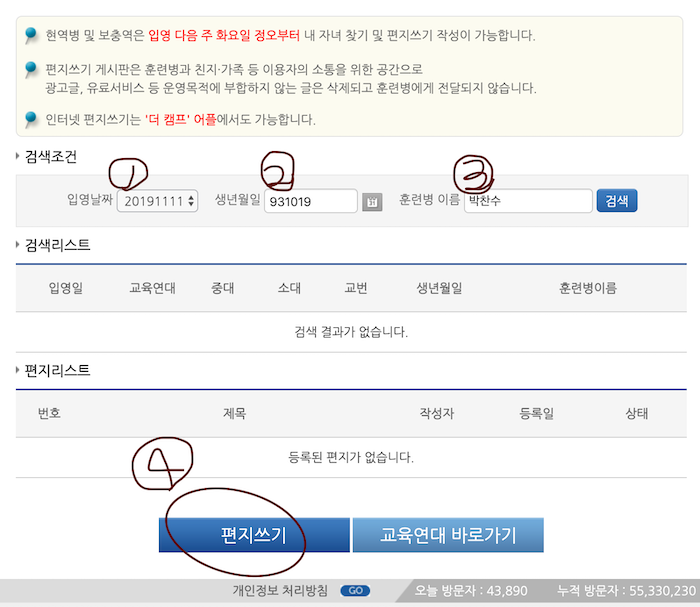

> 빡빡이 찬수가 인터넷 편지를 읍소합니다...
> 한문장의 편지라도 큰 힘이 될 수 있습니다

# 필요한 정보
| 입영일자 | 생년월일 | 훈련병 이름 | 편지 홈페이지 |
|---|:---:|---:|---:|
| `20200402` | `931019` | `박찬수` | [내 자녀찾기](https://choosealicense.com/licenses/mit/) |
#### * 편지 보내기 가능한 날짜: 4월 7일(화) ~ 4월 28일(화) *

# 설명
> 생각보다 쉬워요! 포기하지 말아주세요 으아
## A. 홈페이지를 이용하자! ( [어플리케이션이 더 좋다면 아래로!](#더캠프) )
- 장점: 컴퓨터라 텍스트를 쓰기 편하다, 다른 사람들의 편지 제목을 볼 수 있다.
- 단점: 본인인증이 귀찮다. 본인인증에는 [병무청 간편인증-Android](https://play.google.com/store/apps/details?id=kr.go.mma.bcpsapp) / [병무청 간편인증-Apple](https://apps.apple.com/kr/app/%EB%B3%91%EB%AC%B4%EC%B2%AD-%EA%B0%84%ED%8E%B8%EC%9D%B8%EC%A6%9D/id1488297209) 앱을 이용하는게 편할 수도 있다.
1. [육군훈련소 내 자녀찾기](http://www.katc.mil.kr/katc/community/children.jsp) 접속하기
2. 입영일자(`20200402`), 생년원일(`931019`), 훈련병 이름(`박찬수`)를 채우고 `검색` 버튼 클릭! 그리고 편지 쓰기까지 클릭

3. 텍스트와 이미지를 자유롭게 넣어서 전송 완료!

## B. 어플리케이션을 이용하자!
##### 더캠프
- 장점: 한번 인증하면 본인인증 없어도 된다. 내 편지는 다른 사람에게 제목도 안 보인다.
- 단점: 앱을 깔아야한다. 처음 훈련생을 등록할때 나오는 연대(23 or 25연대)를 외워야 할 수도 있다.
1. 앱을 설치한다. [Apple](https://apps.apple.com/kr/app/the-camp/id1364855523), [Android](https://play.google.com/store/apps/details?id=com.enabledaonsoft.thecamp&hl=ko)
2. 보고 싶은 군인 ➕를 클릭하고, 입영일자(`20200402`), 생년원일(`931019`), 훈련병 이름(`박찬수`)를 채우고 `검색`
3. 좀더 상세한 설명은 [이 링크](https://m.blog.naver.com/lynncandy0829/221739309189)에 자세하게 나와있습니다!

# 여기까지 읽어주셔서 감사하며... 
#### 다들 꼭 건강하시고, 저도 안전하게 있다 나와서 한명한명 연락드릴게요! 그리고, 가장 인상적인 편지를 써주신 분께 저도 약소한 답례를 약속합니다! 🤗

